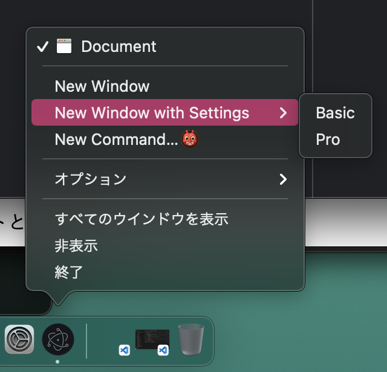

# カスタムメニューを追加する
## Electronでカスタムメニューを追加する
- `Menu` モジュールを使用することで簡単に追加できる

## サンプルコード
```js
const { app, BrowserWindow, Menu } = require("electron");

const createWindow = () => {
  const window = new BrowserWindow({
    width: 800,
    height: 600
  });

  window.loadFile("index.html");
}

// カスタムメニューの本体
// 配列にオブジェクトを渡してMenuインスタンスを初期化する
const dockMenu = Menu.buildFromTemplate([
  {
    label: "New Window",
    click() {
      console.log("New Window");
    }
  }, {
    label: "New Window with Settings",
    submenu: [
      { label: "Basic" },
      { label: "Pro" }
    ]
  }, {
    label: "New Command...👹"
  }
]);

app.whenReady().then(() => {
  if(process.platform === "darwin") app.dock.setMenu(dockMenu);
}).then(() => {
  createWindow();
  
  app.on("activate", () => {
    if(BrowserWindow.getAllWindows().length === 0) createWindow();
  });
});

app.on("window-all-closed", () => {
  if(process.platform !== "darwin") app.quit();
});
```

## 実行結果
