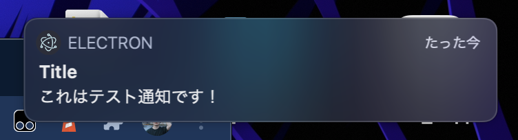

# 通知機能を追加する
## Electronで通知機能を追加する
- めっちゃ簡単。とりあえずレンダラープロセスで通知を表示する。
- Electronでは `Notification` モジュールを使用することで、簡単に通知を実装することができる

## `Notification` モジュールの導入方法
- `index.html` に以下のコードを追加する

```js
<script src="renderer.js"></script>
```

- `renderer.js` を用意する
- 以下のコードを書く

```js
const NOTIFICATION_TITLE = "Title";
const NOTIFICATION_BODY = "これはテスト通知です！";
const CLICK_MESSAGE = "Notification Clicked";

new Notification(NOTIFICATION_TITLE, { body: NOTIFICATION_BODY }).onclick = () => {
  console.log(CLICK_MESSAGE);
}
```

- 以下のように表示される。簡単でしょ？



- さらに通知をクリックすると、コンソールにログが書き込まれる。

