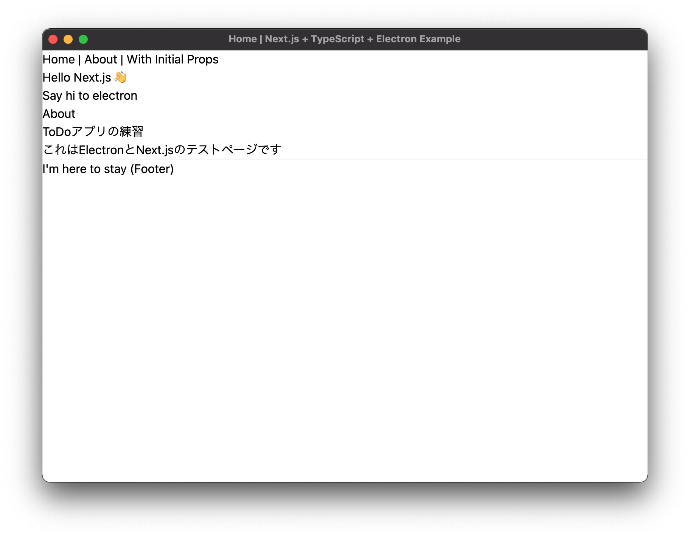
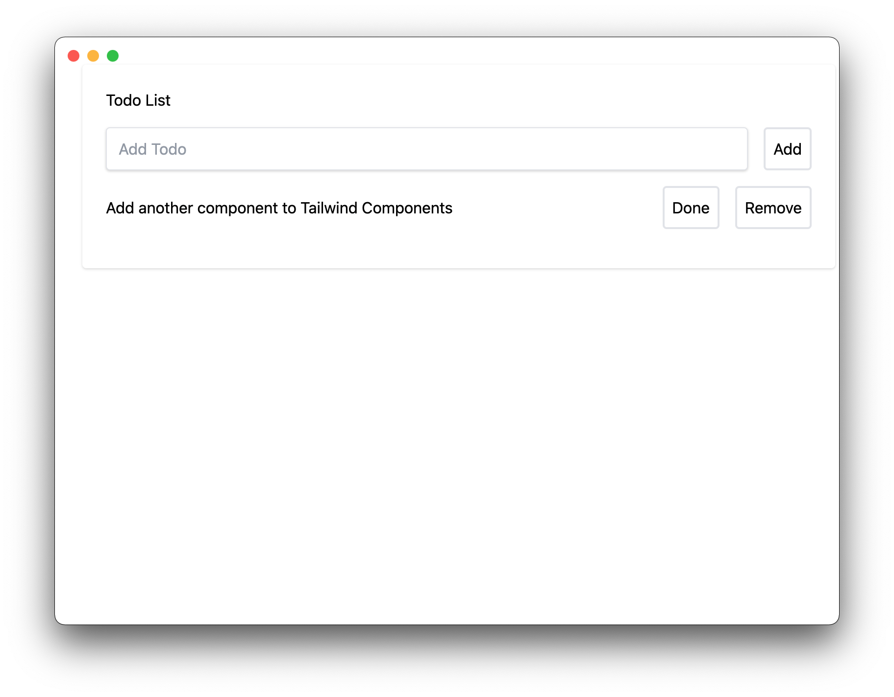

# フレームレスにする
## フレームレス？
- macOSの場合、デフォルトでは上部にバーが存在する
- あまりカッコよくはない



- このフレームを消して、信号だけにすることができる
- かっちょいい



## 方法
- メインプロセスの `BrowserWindow` インスタンス初期化時に、`frame` もしくは `titleBarStyle` を指定する

```ts
// Native
import { join } from 'path'
import { format } from 'url'

// Packages
import { BrowserWindow, app, ipcMain, IpcMainEvent } from 'electron'
import isDev from 'electron-is-dev'
import prepareNext from 'electron-next'
import { customMenu } from './custom-menu'

// Prepare the renderer once the app is ready
app.on('ready', async () => {
  await prepareNext('./renderer')

  const mainWindow = new BrowserWindow({
    width: 800,
    height: 600,
    frame: false, // 上部のフレームを信号ごと消したい場合はこちらを指定する
    titleBarStyle: "hidden", // 信号を残して上部のバーのみ消す場合はこちらを指定する
    webPreferences: {
      nodeIntegration: false,
      contextIsolation: false,
      preload: join(__dirname, 'preload.js'),
    },
  })

  const url = isDev
    ? 'http://localhost:8000/'
    : format({
        pathname: join(__dirname, '../renderer/out/index.html'),
        protocol: 'file:',
        slashes: true,
      })

  mainWindow.loadURL(url)
})

app.whenReady().then(() => {
  if(process.platform === "darwin") app.dock.setMenu(customMenu);
});

// Quit the app once all windows are closed
app.on('window-all-closed', app.quit)

// listen the channel `message` and resend the received message to the renderer process
ipcMain.on('message', (event: IpcMainEvent, message: any) => {
  console.log(message)
  setTimeout(() => event.sender.send('message', 'hi from electron'), 500)
})

```

<!-- ## ウインドウをドラッグ可能にする
- このままだと、ウインドウをドラッグで動かすことができない
- そのためには、... (編集中) -->